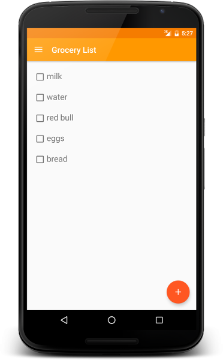

# Grocery list
 

It's my traning application.
App is a simple grocery list. Its main feature is a cross-devices sync using FCM.
It was developed with using: 
* Firebase Cloud Message
* Facebook Sign In
* Retrofit 2.0
* Picasso
* SQLite

Check it out on [Play Market](https://play.google.com/store/apps/details?id=ua.com.amicablesoft.android.grocerylist).
